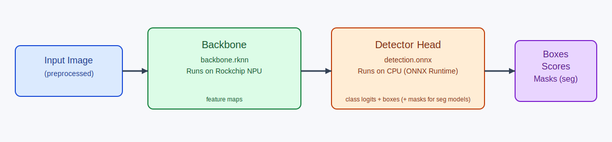
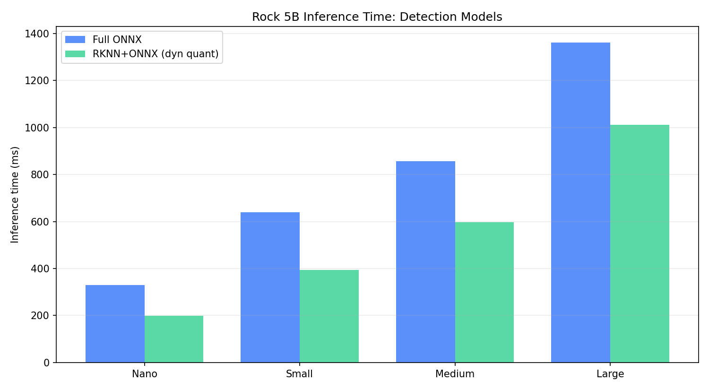
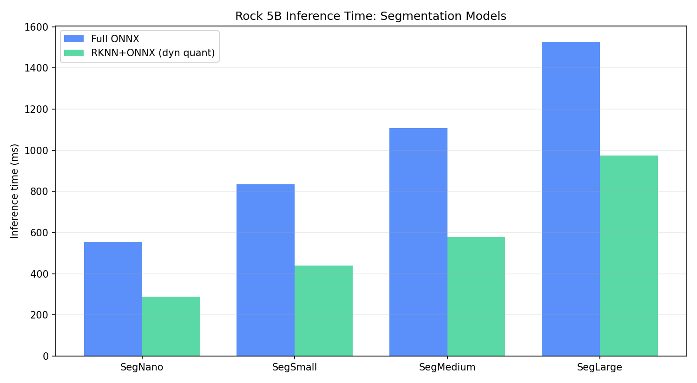

# Deploy RF-DETR model on Rockchip NPU: Split Backbone on NPU, Detector on CPU

This repository shows a practical [RF-DETR](https://github.com/roboflow/rf-detr) deployment path for [Rockchip NPU](https://github.com/airockchip/rknn-toolkit2) devices:

- Run RF-DETR backbone on Rockchip NPU (`backbone.rknn`).
- Run detector/transformer head on CPU with [ONNX Runtime](https://onnxruntime.ai/) (`detection.onnx`).
- Keep everything reproducible with [Docker](https://www.docker.com/).

RF-DETR is a real-time transformer-based object detection model family. This repository supports both RF-DETR **detection** models and RF-DETR **segmentation** models.

## Why this project exists

Full RF-DETR ONNX models are transformer-heavy and are not a good fit for end-to-end RKNN conversion in practice.

The backbone converts and runs well on RKNN, so we split the model:

1. Export full ONNX (`inference_model.onnx`) for reference/baseline.
2. Export split ONNX (`backbone.onnx` + `detection.onnx`).
3. Convert only backbone ONNX to RKNN (`backbone.rknn`).
4. Run inference as `RKNN backbone + ONNX detector`.

This keeps output quality close to full ONNX while improving latency.

## Visual overview



## Benchmark results (Rock 5B, RK3588)

Method:

- CPU pinning: `--cpuset-cpus=4-7`
- Warmup: `1`
- Runs: `10`
- Metric: model inference time only

Raw result file: `benchmarks/rock5b_benchmarks.json`

### Detection models

| Model | Full ONNX (ms) | RKNN+ONNX (ms) | Speedup (x) | Reduction (%) |
|---|---:|---:|---:|---:|
| RFDETRNano | 329.31 | 198.42 | 1.66 | 39.7 |
| RFDETRSmall | 639.73 | 394.58 | 1.62 | 38.3 |
| RFDETRMedium | 857.12 | 597.00 | 1.44 | 30.3 |
| RFDETRLarge | 1362.05 | 1011.49 | 1.35 | 25.7 |



### Segmentation models

| Model | Full ONNX (ms) | RKNN+ONNX (ms) | Speedup (x) | Reduction (%) |
|---|---:|---:|---:|---:|
| RFDETRSegNano | 554.60 | 289.25 | 1.92 | 47.8 |
| RFDETRSegSmall | 834.70 | 438.97 | 1.90 | 47.4 |
| RFDETRSegMedium | 1106.81 | 576.45 | 1.92 | 47.9 |
| RFDETRSegLarge | 1527.16 | 973.88 | 1.57 | 36.2 |



## What hardware you need

- One x86_64 machine (laptop/server/VM): export ONNX, convert RKNN, run simulator checks.
- One RKNN device, like [Rock 5B](https://radxa.com/products/rock5/5b/) (RK3588, ARM64): run real NPU deployment checks and benchmarks.

## Docker images and where to build them

- Build on x86:
  - `Dockerfile.onnx` -> image `rfdetr-onnx`
  - `Dockerfile.rknn` -> image `rfdetr-rknn`
- Build on Rock 5B:
  - `Dockerfile.deploy` -> image `rfdetr-deploy`

## Build images

On x86:

```bash
docker build -f Dockerfile.onnx -t rfdetr-onnx .
docker build -f Dockerfile.rknn -t rfdetr-rknn .
```

On Rock 5B:

```bash
docker build -f Dockerfile.deploy -t rfdetr-deploy .
```

## Script summary

- `export_onnx.py`: full ONNX + split ONNX export
- `verify_onnx.py`: full vs split ONNX comparison
- `convert_rknn.py`: `backbone.onnx` -> `backbone.rknn`
- `verify_rknn.py`: simulator check (`RKNN toolkit2 + ONNX`)
- `verify_deploy.py`: real NPU check (`RKNNLite + ONNX`)
- `benchmark_deploy.py`: per-model latency benchmark on Rock 5B

## Step-by-step workflow

### 1) Export ONNX models (x86)

This creates:

- `output/inference_model.onnx` (official RF-DETR export path)
- `output/backbone.onnx` (split backbone)
- `output/detection_fp32.onnx` (split detector float)
- `output/detection.onnx` (dynamic-quantized detector by default)

```bash
docker run --rm -v "$(pwd)":/workspace -w /workspace \
  rfdetr-onnx \
  python export_onnx.py --output-dir output
```

Useful flags:

- `--model RFDETRMedium` (default; can use detection/segmentation classes)
- `--weights /workspace/path/to/your_checkpoint.pth` for fine-tuned weights
- `--resolution 384` to export at another fixed resolution
- `--no-dynamic-quant` to keep detector non-quantized

Example with fine-tuned segmentation model:

```bash
docker run --rm -v "$(pwd)":/workspace -w /workspace \
  rfdetr-onnx \
  python export_onnx.py \
    --model RFDETRSegMedium \
    --weights /workspace/checkpoint_best_total.pth \
    --output-dir output
```

### 2) Verify full ONNX vs split ONNX (x86)

This checks that your split export is functionally correct before introducing RKNN.

`verify_onnx.py` runs:

- full model path: `inference_model.onnx`
- split path: `backbone.onnx` + `detection_fp32.onnx`

Then it compares raw tensors and postprocessed detections.
Expected behavior: exact match when using `detection_fp32.onnx` (same math path, no quantization).
It also writes an annotated image so you can visually confirm results.

```bash
docker run --rm -v "$(pwd)":/workspace -w /workspace \
  rfdetr-onnx \
  python verify_onnx.py --image bus.jpg --output-dir output --output-image bus_onnx.jpg
```

### 3) Convert backbone ONNX to RKNN (x86)

This is the handoff point from ONNX to Rockchip format.

`convert_rknn.py` takes `backbone.onnx`, runs RKNN Toolkit2 conversion for `rk3588`, and produces `backbone.rknn`.
We convert only the backbone because this is the part that maps well to RKNN in practice.

```bash
docker run --rm -v "$(pwd)":/workspace -w /workspace \
  rfdetr-rknn \
  python convert_rknn.py --input output/backbone.onnx --output output/backbone.rknn --target-platform rk3588
```

### 4) Verify RKNN(simulated) + ONNX on x86

This validates the hybrid pipeline before moving to the Rock board.

`verify_rknn.py` runs the backbone through RKNN Toolkit2 simulator (x86), then feeds those features into the ONNX detector on CPU.
It compares that output against full ONNX and writes an annotated result image.

This is mainly a development sanity check:

- confirms the split pipeline wiring is correct
- catches obvious conversion/runtime issues early
- avoids debugging first on-device

```bash
docker run --rm -v "$(pwd)":/workspace -w /workspace \
  rfdetr-rknn \
  python verify_rknn.py --image bus.jpg --output-dir output --output-image bus_rknn.jpg
```

### 5) Verify real NPU deployment on Rock 5B

This runs the actual Rockchip NPU via RKNN Lite2 and saves `bus_deploy.jpg`.

Before running this command on the Rock 5B, make sure the device has:

- this repository checkout (for example at `/home/radxa/rfdetr-on-rockchip-npu/`)
- `output/inference_model.onnx`
- `output/backbone.onnx`
- `output/detection.onnx`
- `output/backbone.rknn`

Example copy from your x86 machine to the Rock 5B:

```bash
rsync -av output/ \
  radxa@<rock5b-ip>:/home/radxa/rfdetr-on-rockchip-npu/output/
```

Then SSH to the Rock 5B, `cd /home/radxa/rfdetr-on-rockchip-npu`, and run the deploy command below.

```bash
docker run --rm --privileged \
  --cpuset-cpus=4-7 \
  -v /dev:/dev \
  -v /sys:/sys \
  -v /proc/device-tree:/proc/device-tree:ro \
  -v /usr/lib/librknnrt.so:/usr/lib/librknnrt.so:ro \
  -v "$(pwd)":/workspace \
  -w /workspace \
  rfdetr-deploy \
  python verify_deploy.py --image bus.jpg --output-dir output --output-image bus_deploy.jpg
```

If your host only has a versioned runtime file (for example `/usr/lib/aarch64-linux-gnu/librknnrt.so.2.x.x`), bind it to `/usr/lib/librknnrt.so` inside the container.

Why `--cpuset-cpus=4-7`: pins ONNX detector stage to Rock 5B big cores for more stable/better CPU-side performance.

RKNN stack used here:

- x86 conversion/simulation: [`rknn-toolkit2`](https://pypi.org/project/rknn-toolkit2/)
- Rock deploy runtime: [`rknn-toolkit-lite2`](https://pypi.org/project/rknn-toolkit-lite2/)

### 6) Benchmark on Rock 5B (single exported model)

Measures model inference only (preprocess once, no postprocess timing).

```bash
docker run --rm --privileged \
  --cpuset-cpus=4-7 \
  -v /dev:/dev \
  -v /sys:/sys \
  -v /proc/device-tree:/proc/device-tree:ro \
  -v /usr/lib/librknnrt.so:/usr/lib/librknnrt.so:ro \
  -v "$(pwd)":/workspace \
  -w /workspace \
  rfdetr-deploy \
  python benchmark_deploy.py --image bus.jpg --output-dir output --warmup 1 --runs 10
```

To benchmark with non-quantized detector ONNX:

```bash
docker run --rm --privileged \
  --cpuset-cpus=4-7 \
  -v /dev:/dev \
  -v /sys:/sys \
  -v /proc/device-tree:/proc/device-tree:ro \
  -v /usr/lib/librknnrt.so:/usr/lib/librknnrt.so:ro \
  -v "$(pwd)":/workspace \
  -w /workspace \
  rfdetr-deploy \
  python benchmark_deploy.py --image bus.jpg --output-dir output --warmup 1 --runs 10 --detector-onnx detection_fp32.onnx
```
